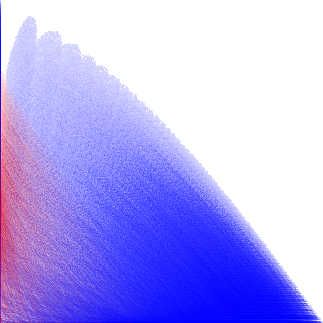
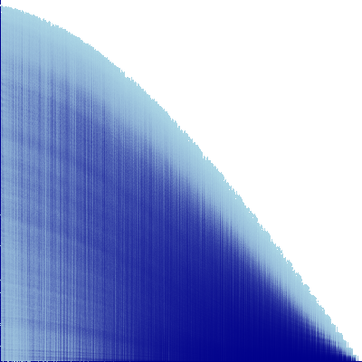
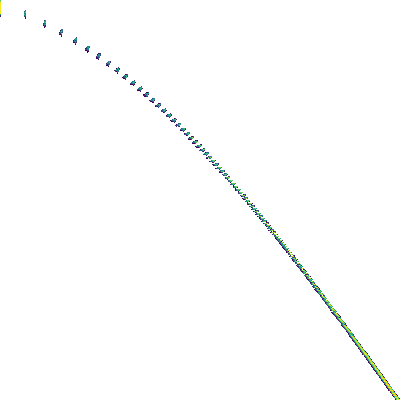

# Paper: What Role can NOMA Play in Massive MIMO? -  Prof. Emil 
[What Role can NOMA Play in Massive MIMO?](https://arxiv.org/pdf/1809.07072) 这篇文章对比了MISO系统中SDMA和NOMA的性能差异，在文中用mMIMO代替SDMA。文中从分析和数据仿真的角度证实了：
- 当基站发射天线数远多于用户数时，在NLos和Los场景下，SDMA明显优于Group-based NOMA;
- 但是，当基站发射天线数和用户数接近时，在NLos和Los场景下，Group-based NOMA优于SDMA。进一步，还得出了当每个Group内用户间的信道质量差距很大时，NOMA能发挥更大的优势；
- 文章进一步分析了Los信道场景中不同天线数下，用户随机分布，NOMA优于SDMA的概率。结果表明在用户数固定为6设定下，尽管天线数为36时，NOMA优于SDMA的概率接近20%。因此不能以偏概全的认为天线数少于用户数时NOMA优于SDMA，反之，SDMA优于NOMA；
- 文章进一步探讨了将SDMA和NOMA结合起来的方案hybrid mMIMO-NOMA。在这种方案下，当某些信道的信道相关性强时就会被分配到同一组中采用NOMA的方式与基站建立链接；如果某些用户和其他用户信道相关性都不强则不会分配group而是直接采用SDMA的方式与基站建立链接。

> - 应引起重视的是我现在认知中的RSMA并不是真正的RSMA而是1 layer RS.
{: .prompt-danger }

> - 疑问1：文中考虑的MISO NOMA都是Group-based NOMA，Group-based NOMA的特点是既利用了SISO NOMA自带的power domain又利用了multi-antenna的spatial domain（但是没有充分利用spatial domain）。然而为什么文中没考虑non-group-based NOMA？我个人猜想，同时也结合[知乎某位学者关于non-group-based NOMA的评论](https://www.zhihu.com/question/38995447)，我的理解是如果用户信道相关性不高non-group-based NOMA的power domain完全变成冗余的了。因为信道相关性不高，就会使得用户间干扰可以很好的消除根本没必要再使用SIC。
待办：这里有必要验证一下信道相关性不高的情况下强行使用non-group-based NOMA会有什么结果？
{: .prompt-warning }

> - 自答1：参考仿真结果图1和图4，可以看出在用户信道相关性不强时non-group-based NOMA的性能比SDMA低。假设在non-group-based NOMA中使用SDMA的一组precoder，由于non-group-based NOMA需要确保强用户能解码弱用户的信息，因此发给弱用户的信息也应发给强用户，这就使得部分能量被浪费了，为此，在这种情况下，non-group-based NOMA就会比SDMA差。
{: .prompt-info }

> - 疑问2：文中Group-based NOMA的beamforming的设计思路是：先忽略所有的cell-edge users，采用zero forcing方法设计cell-center users的beamforming，每个cell-center user的beamforming就是这个组的beamforming。文中这样设计的目的是消除组间干扰，但文中也提到了这样设计会导致cell-edge users无法获得array gain。针对Group-based NOMA的beamforming是否还可以采取其他方法？
{: .prompt-warning }

> - 自答2：待解决。
{: .prompt-info }

> - 疑问3：在SISO中，NOMA通常将信道弱的定为弱用户，信道强的用户称为强用户。但是在MISO或者MIMO中，还能仅根据信道好坏来判定强用户或者弱用户吗？考虑一个Los场景，基站配备多天线，A用户离基站近些，B用户远些；但是基站的波束指向B用户，这时候能仅通过信道强弱来判定谁是强用户吗？
那么在设计同一组用户的发射信号时，功率分配因子的设定往往是需要给弱用户分配更多的能量。然而，Multi antenna场景中，该怎么去设计这个功率分配因子呢？
[Optimal User Pairing for Downlink Non-Orthogonal Multiple Access (NOMA)](https://arxiv.org/pdf/1812.11490) 这篇文章中考虑了一个SISO NOMA的系统，自然而然的，用户的强弱就要根据信道强弱来判定；
[Design of Downlink Hybrid NOMA Transmission](https://arxiv.org/pdf/2401.16965)这篇文章似乎是考虑了MISO NOMA，好像提到了综合考虑信道和波束来判断用户的强弱，而不是仅考虑信道强弱。
[A Minorization-Maximization Method for Optimizing Sum Rate in the Downlink of Non-Orthogonal Multiple Access Systems](https://arxiv.org/pdf/1505.05735) 这篇文章讨论了single cluster MISO NOMA。文中判定用户强弱的依据不仅是信道强弱还包括基站的发射波束。在这个博客所考虑的2 users场景，根据$\left|{\bf{h}}_1{\bf{w}}_1\right|$和$\left|{\bf{h}}_2{\bf{w}}_2\right|$的大小关系判定谁是强用户。但文章中其实也说了解码顺序是可以预先设定好，然后根据这个顺序反过来调整强弱用户，进而调整波束。不一定完全按照先明确强弱用户，然后才确定用户顺序的方式。
{: .prompt-warning }

> - 自答3：在SISO NOMA中，通常根据信道强弱来判定用户的强弱；在MISO NOMA中，通常不会采用non-group-based NOMA而是采用Group NOMA，对于Group NOMA通常根据共享波束和各自信道的内积的大小来判定强弱用户。其实，如果组内用户信道质量相差较大的情况下也可以直接根据信道强弱来判定。
{: .prompt-info }
# Impact of User Channel Correlation and User Distance on the Performance of RSMA, SDMA, and NOMA Systems.
## 1. System setting:

- System describtion:
2 users. User 1 is stronger user. Only consider Los scenary.
- System variable:
The users’ angles relative to the base station, $\theta_1, \theta_2$; The number of transmit antennas at BS, N.
## 2. Four Multiple Access Techniques
### 2.1. SDMA: (Spatial domain)
Transmit signal: ${\bf{x}} = { {\bf{p}}_1}{s_1} + { {\bf{p}}_2}{s_2}$,
Achievable rate of each user:

$$
\begin{aligned}
{R_1} = \log \left( {1 + \frac{ { { {\left| { { {\bf{h}}_1}{ {\bf{p}}_1}} \right|}^2}}}{ { { {\left| { { {\bf{h}}_1}{ {\bf{p}}_2}} \right|}^2}+{\sigma ^2}}}} \right), \\
{R_2} = \log \left( {1 + \frac{ { { {\left| { { {\bf{h}}_2}{ {\bf{p}}_2}} \right|}^2}}}{ { { {\left| { { {\bf{h}}_2}{ {\bf{p}}_1}} \right|}^2} + {\sigma ^2}}}} \right).
\end{aligned}
$$

Problems:

$$
\begin{aligned}
\mathop {\max }\limits_{ { {\bf{p}}_1},{ {\bf{p}}_2}} &{R_1} + {R_2}\\
s.t.\quad &{R_1} \ge {\eta _1}\\
& {R_2} \ge {\eta _2}\\
&  {\left| { { {\bf{p}}_1}} \right|^2} + {\left| { { {\bf{p}}_2}} \right|^2} \le {P_t}
\end{aligned},
$$

$$
\begin{aligned}
\mathop {\max }\limits_{ { {\bf{p}}_1},{ {\bf{p}}_2}} \mathop {\min }\limits_k &{R_k}\\
s.t. \quad & {\left| { { {\bf{p}}_1}} \right|^2} + {\left| { { {\bf{p}}_2}} \right|^2} \le {P_t}
\end{aligned}
$$

### 2.2. Group-based NOMA: (Power domain), assume user1 is strong user.
Transmit signal: ${\bf{x}} = {P_1}{\bf{v}}{s_1} + {P_2}{\bf{v}}{s_2}$, where ${\bf{v}}$ denotes group beamer.
Achievable rate of each user:

$$
\begin{aligned}
{R_2} &= \log \left( {1 + \frac{ { {P_2}{ {\left| { { {\bf{h}}_2}{\bf{v}}} \right|}^2}}}{ { {P_1}{ {\left| { { {\bf{h}}_2}{\bf{v}}} \right|}^2} + {\sigma ^2}}}} \right),\\
{R_1} &= \log \left( {1 + \frac{ { {P_1}{ {\left| { { {\bf{h}}_1}{\bf{v}}} \right|}^2}}}{ { {\sigma ^2}}}} \right), \\
{R_{1,2}} &= \log \left( {1 + \frac{ { {P_2}{ {\left| { { {\bf{h}}_1}{\bf{v}}} \right|}^2}}}{ { {P_1}{ {\left| { { {\bf{h}}_1}{\bf{v}}} \right|}^2} + {\sigma ^2}}}} \right).
\end{aligned}
$$

Problems:

$$
\begin{aligned}
\mathop {\max }\limits_{ {P_1},{P_2},{\bf{v}}} &{R_1} + {R_2}\\
s.t. \quad &\left|{\bf{h}}_1{\bf{v}}\right| \ge \left|{\bf{h}}_2{\bf{v}}\right|,\\
&{R_1} \ge {\eta _1},\\
&{R_2} \ge {\eta _2},\\
&{\left| {\bf{v}} \right|^2} = 1,\\
&{P_1} + {P_2} \le {P_t},\\
& {P_1},{P_2} \ge 0
\end{aligned}
$$

$$
\begin{aligned}
\mathop {\max }\limits_{ {P_1},{P_2},{\bf{v}}} \mathop {\min }\limits_k &{R_k}\\
s.t.\quad &\left|{\bf{h}}_1{\bf{v}}\right| \ge \left|{\bf{h}}_2{\bf{v}}\right|,\\
&{\left| {\bf{v}} \right|^2} = 1,\\
&{P_1} + {P_2} \le {P_t},\\
& {P_1},{P_2} \ge 0.
\end{aligned}
$$

> - 起先，我把${R_{1,2}} \ge {R_2}$这个约束放进了上面这两个优化问题中，但是经过思考之后发现是多余的。注意到这两个个优化问题下面的第一个约束，这个约束明确了user1和user2中user1是强用户。把这个约束代入到$R_2,R_{1,2}$的定义式中化简之后发现在这个约束下$R_2 \le R_{1,2}$恒成立。因此不必加上${R_{1,2}} \ge {R_2}$这个约束。
{: .prompt-warning }

> - 通过仿真得出一个经验：对于MISO NOMA系统，大多都是基于分组的方式来实现NOMA的。然而，天线数会影响MISO NOMA的性能。当天线数非常多时，某个角度下的波束必然很窄，如果此时同一组内的用户之间在相对基站的角度上差距较大的话，势必导致某一个甚至两个用户的接收信号微乎其微。但是如果天线数太少会导致分组受限，为了有效的实现组间干扰消除，必须保证足够的天线数提供空域自由度；而且如果分组受限，导致每个组内用户变多就会导致SIC复杂度增加以及错误传播问题加剧。那是不是MISO NOMA只能在较少天线的系统下才能运行？我认为不是，首先NOMA在用户间信道相关性较大时才能释放出来，所以一方面保证同一组的用户信道相关性足够强；另一方面如果基站天线足够多角度分辨率非常强时，可以通过减小基站在该组的分辨率；最后如果仍然不行，那索性把这个组的用户拆开，采用hybrid SDMA NOMA的方式为用户提供服务。
针对这个天线太多导致波束太窄无法为角度差距大的用户们提供服务的问题在[Design of Downlink Hybrid NOMA Transmission](https://arxiv.org/pdf/2401.16965)这篇文中第三节第二段也提到了：‘Wenote that for conventional far-field beamforming, the concept of beam-sharing is straightforward, since many users can share the same beam-steering vector and hence can be served by a single far-field beam[1]. However, the accurate beamfocusing in near-fieldcommunications can make beam sharing difficult，which is another motivation for using near-field beamforming for the feasibility study of hybrid NOMA in downlink MISO systems.’。这段文字的意思是由于波束呈放射状发射出去，随着距离的增加，波束在远处所覆盖的范围会比在近处大。因此，当多个用户处于较远位置时，发射给他们同一个波束可以实现波束共享；但如果用户距离基站较近，波束的覆盖范围较小，用户之间的空间重叠度降低，此时实现波束共享就会变得困难。
{: .prompt-warning }

### 2.3. Non-group-based NOMA: (Power domain and Spatial domain), assume user1 is strong user.
Transmit signal: ${\bf{x}} = { {\bf{p}}_1}{s_1} + { {\bf{p}}_2}{s_2}$,
Achievable rate of each user:

$$
\begin{aligned}
{R_2} &= \log \left( {1 + \frac{ { { {\left| { { {\bf{h}}_2}{\bf{p}}_2} \right|}^2}}}{ { { {\left| { { {\bf{h}}_2}{\bf{p}}_1} \right|}^2} + {\sigma ^2}}}} \right),\\
{R_1} &= \log \left( {1 + \frac{ { { {\left| { { {\bf{h}}_1}{\bf{p}}_1} \right|}^2}}}{ { {\sigma ^2}}}} \right), \\
{R_{1,2}} &= \log \left( {1 + \frac{ { { {\left| { { {\bf{h}}_1}{\bf{p}}_2} \right|}^2}}}{ { { {\left| { { {\bf{h}}_1}{\bf{p}}_1} \right|}^2} + {\sigma ^2}}}} \right).
\end{aligned}
$$

Problems:

$$
\begin{aligned}
\mathop {\max }\limits_{ {\bf{p}}_1,{\bf{p}}_2} &{R_1} + {R_2}\\
s.t. \quad &\left|{\bf{h}}_1{\bf{p}}_1\right|^2 \ge \left|{\bf{h}}_2{\bf{p}}_2\right|^2,\\
&{R_1} \ge {\eta _1},\\
&{R_2} \ge {\eta _2},\\
& {\left| { { {\bf{p}}_1}} \right|^2} + {\left| { { {\bf{p}}_2}} \right|^2} \le {P_t}
\end{aligned},
$$

$$
\begin{aligned}
\mathop {\max } \limits_{ {\bf{p}}_1,{\bf{p}}_2} \mathop {\min }\limits_k  &{R_k}\\
s.t. \quad & \left|{\bf{h}}_1{\bf{p}}_1\right|^2 \ge \left|{\bf{h}}_2{\bf{p}}_2\right|^2,\\
&{\left| { { {\bf{p}}_1}} \right|^2} + {\left| { { {\bf{p}}_2}} \right|^2} \le {P_t}
\end{aligned}
$$

### 2.4. RSMA:
Transmit signal: ${\bf{x}} = { {\bf{p}}_c}{s_c} + { {\bf{p}}_1}{s_1} + { {\bf{p}}_2}{s_2}$,
Achievable rate of each user:

$$
\begin{aligned}
{R_{c,1}} &= \log \left( {1 + \frac{ { { {\left| { { {\bf{h}}_1}{ {\bf{p}}_c}} \right|}^2}}}{ { { {\left| { { {\bf{h}}_1}{ {\bf{p}}_1}} \right|}^2}+{ {\left| { { {\bf{h}}_1}{ {\bf{p}}_2}} \right|}^2}+{\sigma ^2}}}} \right), \\
{R_{c,2}} &= \log \left( {1 + \frac{ { { {\left| { { {\bf{h}}_2}{ {\bf{p}}_c}} \right|}^2}}}{ { { {\left| { { {\bf{h}}_2}{ {\bf{p}}_1}} \right|}^2}+{ {\left| { { {\bf{h}}_2}{ {\bf{p}}_2}} \right|}^2}+{\sigma ^2}}}} \right), \\
{R_{p,1}} &= \log \left( {1 + \frac{ { { {\left| { { {\bf{h}}_1}{ {\bf{p}}_1}} \right|}^2}}}{ { { {\left| { { {\bf{h}}_1}{ {\bf{p}}_2}} \right|}^2}+{\sigma ^2}}}} \right), \\
{R_{p,2}} &= \log \left( {1 + \frac{ { { {\left| { { {\bf{h}}_2}{ {\bf{p}}_2}} \right|}^2}}}{ { { {\left| { { {\bf{h}}_2}{ {\bf{p}}_1}} \right|}^2} + {\sigma ^2}}}} \right).
\end{aligned}
$$

Problems:

$$
\begin{aligned}
\mathop {\max }\limits_{ {\bf{p}}_c,{\bf{p}}_1,{\bf{p}}_2} & C_1 + {R_1} + C_2 + {R_2}\\
s.t. \quad &{R_c} = \min(R_{c,1},R_{c,2}),\\
& C_1 + C_2 = R_c, \\
&C_1 + {R_{p,1}} \ge {\eta _1},\\
&C_2 + {R_{p,2}} \ge {\eta _2},\\
& {\left| { { {\bf{p}}_1}} \right|^2} + {\left| { { {\bf{p}}_2}} \right|^2} \le {P_t}
\end{aligned},
$$

$$
\begin{aligned}
\mathop {\max } \limits_{ {\bf{p}}_c,{\bf{p}}_1,{\bf{p}}_2} \mathop {\min }\limits_k  &{C_k + R_k}\\
s.t. \quad & {R_c} = \min(R_{c,1},R_{c,2}),\\
& C_1 + C_2 = R_c, \\
& {\left| { { {\bf{p}}_1}} \right|^2} + {\left| { { {\bf{p}}_2}} \right|^2} \le {P_t}
\end{aligned}
$$

## 3. Simulation results: (rate region, xlabel:R1, ylabel:R2)
### 3.0. simulation setting: 
- 仿真过程中对波束能量约束中将不等式约束改为等式约束，使得基站满功率运行，仿真中设定总功率为单位1。发射天线数为3.

||SDMA|NOMA |RSMA|NG-NOMA|
|:--:|:--:|:--:|:--:|:--:|
|variable|${\bf{p}}_1, {\bf{p}}_2$ | $P_1,P_2,{\bf{v}}$| ${\bf{p}}_c, {\bf{p}}_1, {\bf{p}}_2$ |${\bf{p}}_1, {\bf{p}}_2$|
|free degree space|$\alpha, {\bf{v}}_1, {\bf{v}}_2$ | $\alpha,{\bf{v}}$| ${\alpha, \beta, \gamma,\bf{v}}_c, {\bf{v}}_1, {\bf{v}}_2$ |${\alpha, \bf{v}}_1, {\bf{v}}_2$|

**表注说明：“Variable”行表示在优化问题中涉及的关键变量；“Free Degree Space”表示各多址技术在设计空间中的自由度。可以看出，RSMA 的自由度空间最大，意味着其在参数设计上最为灵活，但也带来了显著的实现复杂性。具体而言，对于 SDMA，$\alpha$ 表示分配给 ${\bf{v}}_1$ 的功率，$1-\alpha$ 表示分配给 ${\bf{v}}_2$ 的功率，${\bf{v}}_1$ 和 ${\bf{v}}_2$ 分别为归一化的波束方向向量；对于 NOMA，$\alpha$ 表示分配给用户1信号的功率，$1-\alpha$ 表示分配给用户2信号的功率，${\bf{v}}$ 为两个用户共享的波束方向；对于 RSMA，$\alpha$ 是分配给公有信息波束的功率，$\beta$ 是将剩余功率$1-\alpha$ 分配给 ${\bf{v}}_1$ 和 ${\bf{v}}_2$ 间的功率，$\gamma$ 是分配给user1的公有信息速率系数，$1-\gamma$ 是分配给user2的公有信息速率系数；对于 NG-NOMA，其变量设置与 SDMA 类似，即 $\alpha$ 作为功率分配因子，${\bf{v}}_1$ 和 ${\bf{v}}_2$ 为归一化波束向量。所有参数均满足以下约束：$\alpha, \beta, \gamma \in [0, 1]$，且${\bf{v}}_c,{\bf{v}}_1,{\bf{v}}_2$ 的模恒为1。在实验仿真中，$\alpha, \beta, \gamma$ 均采用固定步长进行均匀采样，而 ${\bf{v}}_c, {\bf{v}}_1, {\bf{v}}_2$ 则通过在复高斯圆域中采样后归一化获得。由于 RSMA 的设计自由度远大于其他技术，导致其采样空间维度较高，进而在计算资源有限的情况下难以实现充分的参数遍历。这也可能导致 RSMA 的仿真性能与其理论性能存在一定偏差，实验结果未能完全反映其潜在的最优表现。**

**仿真特殊设定：在传统的 SISO NOMA 系统中，基站通常通过估计用户的信道增益来判断用户间的强弱关系，即基于信道质量将用户划分为“强用户”与“弱用户”。然而，在 MISO NOMA 系统中，用户强弱的判断不仅依赖于信道质量，还需综合考虑波束方向与空间特性。具体而言，尽管在某些情况下 User 1 的信道质量优于 User 2，但若波束主要指向 User 2，则实际接收信号强度可能使得 User 1 不再是“强用户”。为更准确反映实际通信情形，本文在 Group NOMA 仿真中引入了一个动态判定模块，该模块根据当前信道状态和波束方向联合判断谁为“强用户”，并据此生成相应的压缩编码信号。如图 2、图 6 和图 10 所示，图中新增的红色点表示系统在判定 User 2 为强用户时对应的两用户速率组合；相应地，蓝色点表示系统在判定 User 1 为强用户 时的速率结果。这一设置能够更全面地刻画 Group NOMA 在不同判定条件下的性能表现。相比之下，在 Non-group NOMA 的仿真中，并未引入类似的判定机制，而是始终假设 User 1 为强用户。其原因有二：一方面，由于 Non-group NOMA 不采用明确的用户分组与共享波束设计，强弱用户判定机制的引入较为复杂，难以实现；另一方面，从图 2、6 和 10 中可以观察到，在用户信道相关性较强的情况下，红色区域（User 2 为强用户）大多被蓝色区域（User 1 为强用户）所包围，即系统在 User 2 为强用户时的速率组合已被包含在 User 1 为强用户的情况中。因此，在对比各技术的性能时，我们主要关注系统所能达到的速率区域上界，故可合理忽略 User 2 为强用户的情况。（这两个原因是我自己的理解，待证实）**

### 3.1. Impact of channel corelation (fixed channel factor: user1 1.0, user2 0.5)

#### 3.1.1 NOMA

|users' angle [-1,1]| users' angle [-5,5]| users' angle [-30,30]|
|:--:|:--:|:--:|
|  |||

#### 3.1.2 SDMA

|users' angle [-1,1]| users' angle [-5,5]| users' angle [-30,30]|
|:--:|:--:|:--:|
|  |||

#### 3.1.3 RSMA

|users' angle [-1,1]| users' angle [-5,5]| users' angle [-30,30]|
|:--:|:--:|:--:|
|  |||

#### 3.1.4 non-group NOMA

|users' angle [-1,1]| users' angle [-5,5]| users' angle [-30,30]|
|:--:|:--:|:--:|
|  |||

> - 从实验结果可以看出，当两个用户在角度域中相隔较远时，SDMA（空间分复用多址）能够实现显著的性能增益。与此同时，RSMA（速率分裂多址）由于具备在共有信息与私有信息之间灵活分配资源的能力，其性能几乎可以与SDMA相媲美。需要指出的是，由于实验结果是通过有限的采样方式得到的，而RSMA具有较高的设计自由度，因此在采样点数量受限的情况下，其理论性能上限可能未能在图中充分体现。
相较之下，Group NOMA（群组非正交多址）的实验结果表明其在此类用户分布场景下并不具备明显优势，主要由于其设计理念更适用于用户间信道相关性较高的情况。最后，Non-group NOMA（非群组NOMA）通过同时利用功率域和空间域资源，尽管在功率域中未能获得理想的性能提升，但其在空间域中仍取得了一定的性能增益，从而在整体性能上具备一定竞争力。
性能比较：$SDMA \approx RSMA > non \ group \ NOMA > NOMA$.
{: .prompt-info  }

> - 随着两个用户在角度域上的距离逐渐接近，性能变化最为显著的是 SDMA，这是由于 SDMA 在很大程度上依赖用户之间的角度分离来实现空间域的干扰抑制。当用户在角度域中分离较远时，Group NOMA 的共享波束难以同时对两个用户有效覆盖，从而限制了其在功率域中的性能增益；而随着角度距离缩小，两个用户共享同一波束的可行性增强，系统从功率域中提取增益的能力随之提升。
尽管 Non-group NOMA 的自由度空间与 SDMA 相当，但由于其引入了 NOMA 技术，当用户信道相关性较弱时，其性能受到一定限制。然而，随着信道相关性增强，功率域压缩编码与用户端的 SIC（串行干扰消除）机制能够更有效地发挥作用，使得 Non-group NOMA 在某些场景下优于 SDMA。
RSMA 表现出极高的灵活性：在用户信道相关性弱时，可退化为 SDMA，实现良好的空间分离性能；而在信道相关性强时，则可退化为 NOMA，通过功率域进行多用户分离，从而依然维持优异的系统性能。这一现象也与现有文献中普遍认为 RSMA 具备高度灵活性的结论相一致。
性能对比（当信道相关性很强时）：$RSMA \approx non \ group \ NOMA \ge NOMA >> SDMA$.
{: .prompt-info  }

### 3.2. Impact of user distance (fixed user's Loc:[-5,5])
#### 3.2.1. NOMA

|user2's channel factor=0.1| user2's channel factor=0.5| user2's channel factor=1.0|
|:--:|:--:|:--:|
|  |||

#### 3.2.2. SDMA

|user2's channel factor=0.1| user2's channel factor=0.5| user2's channel factor=1.0|
|:--:|:--:|:--:|
|  |||

#### 3.2.3. RSMA

|user2's channel factor=0.1| user2's channel factor=0.5| user2's channel factor=1.0|
|:--:|:--:|:--:|
| TODO |TODO|TODO|

**注：RSMA的复杂度太高，导致空间搜索自由度太高，导致短时间无法获得合适的结果图，因此此处无法展示。希望后期提出更好的思路来绘制这系列速率区域仿真结果图。**
#### 3.2.4. non-group NOMA

|user2's channel factor=0.1| user2's channel factor=0.5| user2's channel factor=1.0|
|:--:|:--:|:--:|
|  |||

### 3.3 A Impact of channel corelation(Focus only on boundary points version)
**说明：这部分和第二部分一样，只不过这部分只关注边界点**
#### 3.3.1 NOMA

|users' angle [-1,1]| users' angle [-5,5]| users' angle [-30,30]|
|:--:|:--:|:--:|
|  |||

#### 3.3.2 SDMA

|users' angle [-1,1]| users' angle [-5,5]| users' angle [-30,30]|
|:--:|:--:|:--:|
|  |||

#### 3.3.3 RSMA

|users' angle [-1,1]| users' angle [-5,5]| users' angle [-30,30]|
|:--:|:--:|:--:|
| TODO |TODO|TODO|

**注：RSMA的复杂度太高，导致空间搜索自由度太高，导致短时间无法获得合适的结果图，因此此处无法展示。希望后期提出更好的思路来绘制这系列速率区域仿真结果图。**
#### 3.3.4 non-group NOMA

|users' angle [-1,1]| users' angle [-5,5]| users' angle [-30,30]|
|:--:|:--:|:--:|
|  |||

## 4. Conclusion
能肯定的是，SDMA严格受用户信道相关性影响，在信道相关性弱时能表现出很不错的性能，反之，非常差；group NOMA也受信道相关性的影响但是似乎没有SDMA敏感，group NOMA在信道相关性强时表现更好，而且用户信道大尺度衰落差距大时group NOMA的性能才能真正被凸显出来。不能肯定的是，通过现有的理解和分析，个人仍然无法给出本文所要探讨的问题的答案，无法准确的说出RSMA/NOMA/SDMA到底哪个技术更强。non-group NOMA和RSMA都是比较稳健的方法，可能更能适应当下复杂的通信环境。但non-group NOMA的可行性可能比RSMA更低，因为他依赖强用户执行K-1次SIC，受SIC error propagation的影响可能会严重削弱non-group NOMA的性能。所以，综上所述，RSMA可能更能胜任未来mmWave通信，当然RSMA也存在明显的弊端，就是基站在发送接收信号时复杂度会比较高。
