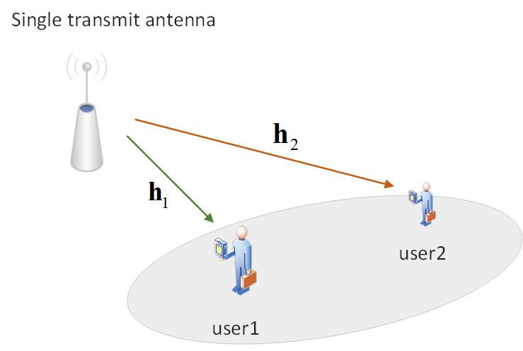
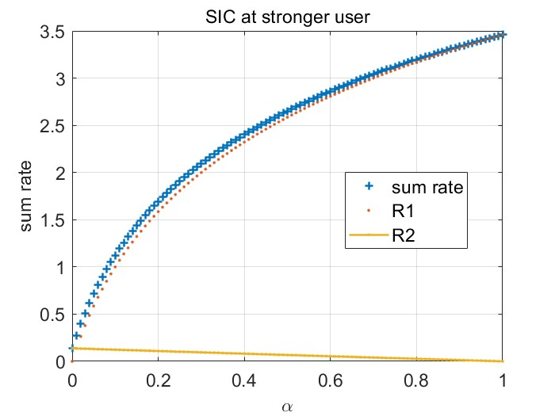
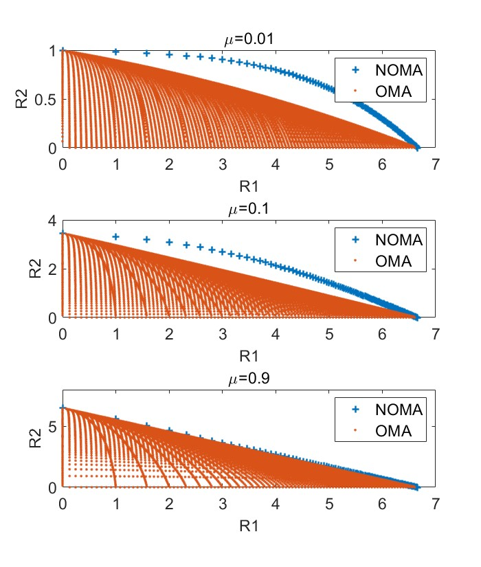

## 0. System setting:


考虑一个单天线基站，两个单天线用户的下行NOMA。假设两个用户处噪声方差$\sigma^2$，信道简化为$h_1=1,h_2=\mu h_1= \mu, \mu \in[0,1]$（user1被认定为强用户，则user1处需执行SIC）, 基站发送的信号$x=P_1 s_1 + P_2 s_2$，其中设$P_1 = \alpha, P_2 = 1- \alpha, \alpha \in [0,1]$。假设SIC是完美的（在[Signal Processing for MIMO-NOMA: Present and Future Challenges](https://arxiv.org/abs/1802.00754) 和 [Fundamentals of Wireless Communication](https://web.stanford.edu/~dntse/wireless_book.html) 第6章 Discussion 6.1中提到目前大多数研究都是基于完美SIC；还提到平均分配功率时会导致极其严重的误码传导。出于简化问题，本文依然考虑完美SIC）。下面分析在不同的信噪比、信道质量以及功率分配因子的条件下，由user1或user2执行SIC时系统的总和速率表现，并探讨这些因素对系统性能的影响。
## 1. 改变功率分配因子
$$
\begin{aligned}
{R_2} &= \log\left(1+\frac{ { {h_2}{P_2}}}{ { {h_2}{P_1} + {\sigma ^2}}}\right) = \log\left(1+\frac{\mu(1- \alpha)}{ {\mu\alpha + \sigma ^2}}\right), \\
{R_{1,2}} &= \log\left(1+\frac{ { {h_1}{P_2}}}{ { {h_1}{P_1} + {\sigma ^2}}}\right) = \log\left(1+\frac{1-\alpha}{ {\alpha + \sigma ^2}}\right), \\
{R_1} &= \log\left(1+\frac{ { {h_1}{P_1}}}{ { {\sigma ^2}}}\right) = \log\left(1+\frac{\alpha}{ { {\sigma ^2}}}\right), \\
{R_{tot}} &= \min \left( { {R_{1,2}},{R_2}} \right) + {R_1} = R_1+R_2,\\
s.t.& \alpha \in [0,1], \mu \in [0,1].
\end{aligned}
$$

仿真结果如下 ($\sigma^2=0.1$)：


> - 另外，参考[Fundamentals of Wireless Communication](https://web.stanford.edu/~dntse/wireless_book.html) 第6章 6.2.2节第一句话‘Let us now return to the general downlink AWGN channel without the symmetry assumption and take h1 < h2. Now user 2 has a better channel than user 1 and hence can decode any data that user 1 can successfully decode.’ 这句话说用户2比用户1的信道好，所以用户2一定能解码用户1能解码的数据。这句话明确了如何判断强弱用户，就是根据信道质量的好坏来判定；而且解释了为什么要在强用户做SIC而不是弱用户，因为强用户一定能解码弱用户能解码的数据，然后经过SIC就能很好的消除用户间干扰；而弱用户并不一定能解码强用户能解码的数据，也就没办法在弱用户进行SIC来消除用户间干扰。
因此，我认为强弱用户的确定是在基站估计出每个用户的信道之后，根据信道的强弱确定了用户的强弱，然后把这个强弱信息告知每个用户，最后用户们根据这个信息明确自己该执行几次SIC。并不是根据功率分配多少来判定谁是强用户，相反功率分配其实也是需要通过确定强弱用户后合理分配能量的。
{: .prompt-warning }


## 2. 改变用户间信道差距
仿真结果如下 ($\sigma^2=0.01$)：


- 观察实验结果可以发现，和OMA对比，随着信道差距变小，NOMA的性能增益逐渐减小。而且还能发现最大和速率都是当功率完全分配给强用户的时候。

>- 参考[Fundamentals of Wireless Communication](https://web.stanford.edu/~dntse/wireless_book.html) 第6章 Discussion 6.1的一句话‘However, we have seen that superposition coding in conjunction with SIC has the largest performance gain when the users have very disparate channels from the base station.’。这里所说的性能增益是相对谁说的？参考书中图6-9，我的理解是增益是相对OMA来说的。起初错误的理解成了固定一个用户的信道，改变另一个的信道，然后观察和速率的变化。仿真结果得到了和这句话相反的结论，结果是因为参考组选择的不对，应该是在相同设置下和OMA对比R1-R2 容量区域的大小。
结合[What Role can NOMA Play in Massive MIMO?](https://arxiv.org/pdf/1809.07072)文中结论部分的一句话‘NOMA benefits from a smaller large-scale fading coefficient for the cell-edge user and a large difference between the large-scale fading coefficients’就能理解NOMA适用于什么场景了。
{: .prompt-warning }

> - 待解决1：尚未明确NOMA中SIC的具体过程。
{: .prompt-warning }

## 附录
```matlab
# 1.vary power factor
alpha = 0:0.01:1;
mu = 0.01; sigma_2 = 0.1;
R2 = log2(1+mu*(1-alpha)./(mu*alpha + sigma_2));
R1 = log2(1+alpha/sigma_2);
sumRate = R1 + R2;

plot(alpha,sumRate,'+','LineWidth',1.5)
hold on
plot(alpha,R1,'.','LineWidth',1.5)
plot(alpha,R2,'.-','LineWidth',1.5)
hold off
legend('sum rate', 'R1','R2')
title('SIC at stronger user')
xlabel('\alpha')
ylabel('sum rate')
grid on
```
```matlab
# 2.vary the channel difference between users
clear,clc; figure, hold on;
sigma_2 = 0.01;

subplot 311
alpha = 0:0.01:1;
mu = 0.01;
R2 = log2(1+mu*(1-alpha)./(mu*alpha + sigma_2));
R1 = log2(1+alpha/sigma_2);
plot(R1,R2,'+','LineWidth',1.5)
hold on

alpha = 0:0.01:1; betas = 0:0.01:1;
N = length(alpha);
R1 = zeros(N,N); R2 = zeros(N,N);
for i = 1:N
    beta = betas(i);
    R1(i,:) = beta*log2(1 + alpha/(beta*sigma_2));
    R2(i,:) = (1-beta)*log2(1 + (1-alpha)*mu/((1-beta)*sigma_2));
end
R1 = R1(:); R2 = R2(:);
plot(R1,R2,'.')
title('\mu=0.01')
hold off
legend('NOMA','OMA')

subplot 312
alpha = 0:0.01:1;
mu = 0.1;
R2 = log2(1+mu*(1-alpha)./(mu*alpha + sigma_2));
R1 = log2(1+alpha/sigma_2);
plot(R1,R2,'+','LineWidth',1.5)
hold on

alpha = 0:0.01:1; betas = 0:0.01:1;
N = length(alpha);
R1 = zeros(N,N); R2 = zeros(N,N);
for i = 1:N
    beta = betas(i);
    R1(i,:) = beta*log2(1 + alpha/(beta*sigma_2));
    R2(i,:) = (1-beta)*log2(1 + (1-alpha)*mu/((1-beta)*sigma_2));
end
R1 = R1(:); R2 = R2(:);
plot(R1,R2,'.')
hold off
title('\mu=0.1')
legend('NOMA','OMA')

subplot 313
alpha = 0:0.01:1;
mu = 0.9;
R2 = log2(1+mu*(1-alpha)./(mu*alpha + sigma_2));
R1 = log2(1+alpha/sigma_2);
plot(R1,R2,'+','LineWidth',1.5)
hold on

alpha = 0:0.01:1; betas = 0:0.01:1;
N = length(alpha);
R1 = zeros(N,N); R2 = zeros(N,N);
for i = 1:N
    beta = betas(i);
    R1(i,:) = beta*log2(1 + alpha/(beta*sigma_2));
    R2(i,:) = (1-beta)*log2(1 + (1-alpha)*mu/((1-beta)*sigma_2));
end
R1 = R1(:); R2 = R2(:);
plot(R1,R2,'.')
hold off
title('\mu=0.9')
legend('NOMA','OMA')
```
