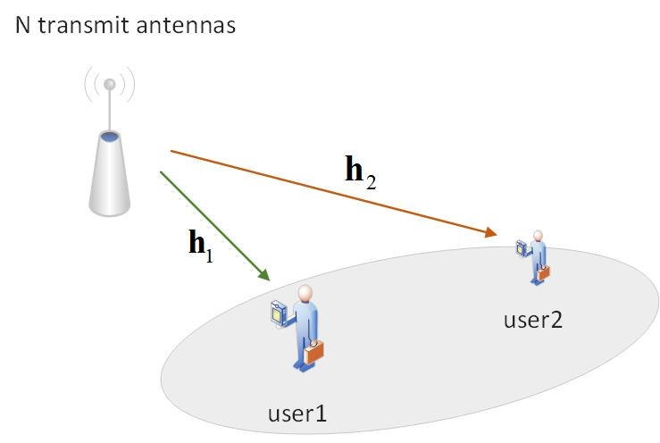

#### 0. System setting:

考虑一个单天线基站，两个单天线用户的下行NOMA。假设两个用户处噪声方差$\sigma^2$，信道简化为$h_1=1,h_2=\mu h_1= \mu, \mu \in[0,1]$, 基站发送的信号$x=P_1 s_1 + P_2 s_2$，其中设$P_1 = \alpha, P_2 = 1- \alpha, \alpha \in [0,1]$。假设SIC是完美的（在[Signal Processing for MIMO-NOMA: Present and Future Challenges](https://arxiv.org/abs/1802.00754) 和 [Fundamentals of Wireless Communication](https://web.stanford.edu/~dntse/wireless_book.html) 第6章 Discussion 6.1中提到目前大多数研究都是基于完美SIC；还提到平均分配功率时会导致极其严重的误码传导。出于简化问题，本文依然考虑完美SIC）。下面分析在不同的信噪比、信道质量以及功率分配因子的条件下，由user1或user2执行SIC时系统的总和速率表现，并探讨这些因素对系统性能的影响。
#### 1. 改变功率分配因子
- 当$\alpha < 0.5$时，
$$
\begin{aligned}
{R_2} &= \log\left(1+\frac{{{h_2}{P_2}}}{{{h_2}{P_1} + {\sigma ^2}}}\right) = \log\left(1+\frac{\mu(1- \alpha)}{{\mu\alpha + \sigma ^2}}\right), \\
{R_{1,2}} &= \log\left(1+\frac{{{h_1}{P_2}}}{{{h_1}{P_1} + {\sigma ^2}}}\right) = \log\left(1+\frac{1-\alpha}{{\alpha + \sigma ^2}}\right), \\
{R_1} &= \log\left(1+\frac{{{h_1}{P_1}}}{{{\sigma ^2}}}\right) = \log\left(1+\frac{\alpha}{{{\sigma ^2}}}\right), \\
{R_{tot}} &= \min \left( {{R_{1,2}},{R_2}} \right) + {R_1} = R_1+R_2,\\
s.t.& \alpha \in [0,0.5], \mu \in [0,1].
\end{aligned}
$$

- 当$\alpha > 0.5$时(尽管这种情况正常情况下不会发生)，
$$
\begin{aligned}
{R_1} &= \log\left(1+\frac{{{h_1}{P_1}}}{{{h_1}{P_2} + {\sigma ^2}}}\right) = \log\left(1+\frac{\alpha}{1-\alpha + \sigma ^2}\right), \\
{R_{2,1}} &= \log\left(1+\frac{{{h_2}{P_1}}}{{{h_2}{P_2} + {\sigma ^2}}}\right) = \log\left(1+\frac{\mu\alpha}{{\mu(1- \alpha) + \sigma ^2}}\right), \\
{R_2} &= \log\left(1+\frac{{{h_2}{P_2}}}{{{\sigma ^2}}}\right) = \log\left(1+\frac{\mu(1-\alpha)}{\sigma ^2}\right), \\
{R_{tot}} &= \min \left( {{R_{2,1}},{R_1}} \right) + {R_2} = R_{2,1} + R_2, \\
s.t.& \alpha \in [0.5,1], \mu \in [0,1].
\end{aligned}
$$

仿真结果如下：

> 解释一下为什么分成alpha大于0.5和小于0.5。这是由NOMA解码的规则决定的，参考[Fundamentals of Wireless Communication](https://web.stanford.edu/~dntse/wireless_book.html)第6章 Summary 6.1 最后一句话 ‘The cancellation order at every receiver is always to decode the weaker users before decoding its own data.’，这就是SIC的规则。当alpha小于0.5时，根据这个规则SIC发生在user1上；当alpha大于0.5时，SIC发生在user2上。
另外，参考[Fundamentals of Wireless Communication](https://web.stanford.edu/~dntse/wireless_book.html) 第6章 6.2.2节第一句话‘Let us now return to the general downlink AWGN channel without the symmetry assumption and take h1 < h2. Now user 2 has a better channel than user 1 and
hence can decode any data that user 1 can successfully decode.’ 这句话说用户2比用户1的信道好，所以用户2一定能解码用户1能解码的数据。这句话解释了为什么要在强用户做SIC而不是弱用户，因为强用户一定能解码弱用户能解码的数据，然后经过SIC就能很好的消除用户间干扰；而弱用户并不一定能解码强用户能解码的数据，也就没办法在弱用户进行SIC来消除用户间干扰。
{: .prompt-warning }

#### 2. 在user2处做SIC


> 待解决1：尚未明确NOMA中SIC的具体过程。
{: .prompt-warning }

> 待解决2：尚未明确NOMA中SIC的具体过程。
{: .prompt-warning }

#### 附录
```matlab
Alpha_ = 0:0.01:1;
mu = 0.1; sigma_2 = 0.01;
% when alpha < 0.5
alpha = Alpha_(1:50);
R2_le = mu*(1-alpha)./(mu*alpha + sigma_2);
R1_le = alpha/sigma_2;
sumRate_le = R1_le + R2_le;
% when alpha > 0.5
alpha = Alpha_(51:101);
R1_ge = mu*alpha./(mu*(1-alpha) + sigma_2);
R2_ge = mu*(1-alpha)/sigma_2;
sumRate_ge = R1_ge + R2_ge;

sumRate = [sumRate_le,sumRate_ge];
R1 = [R1_le,R1_ge];
R2 = [R2_le,R2_ge];

plot(Alpha_,sumRate,'+','LineWidth',1)
hold on
plot(Alpha_,R1,'.','LineWidth',1)
plot(Alpha_,R2,'*','LineWidth',1)
hold off
legend('sum rate', 'R1','R2')
title('SIC at stronger user')
xlabel('\alpha')
ylabel('sum rate')
grid on
```