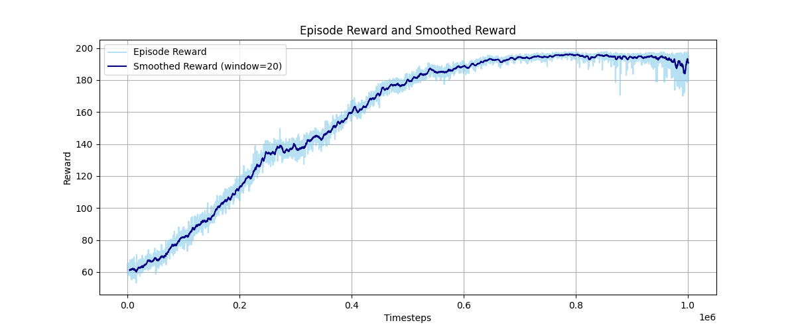
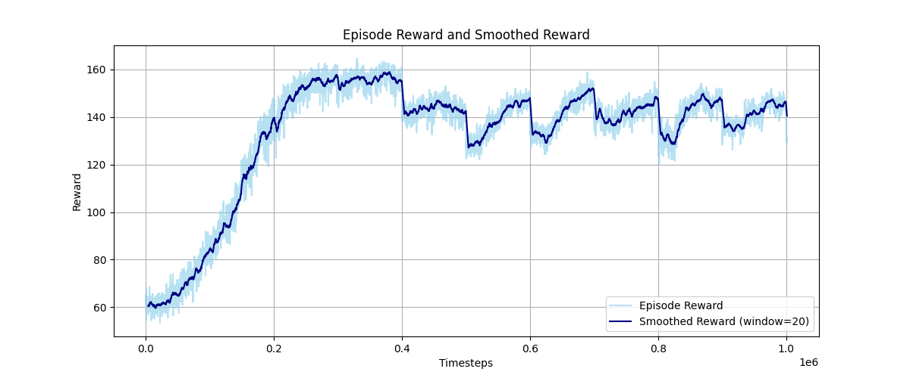
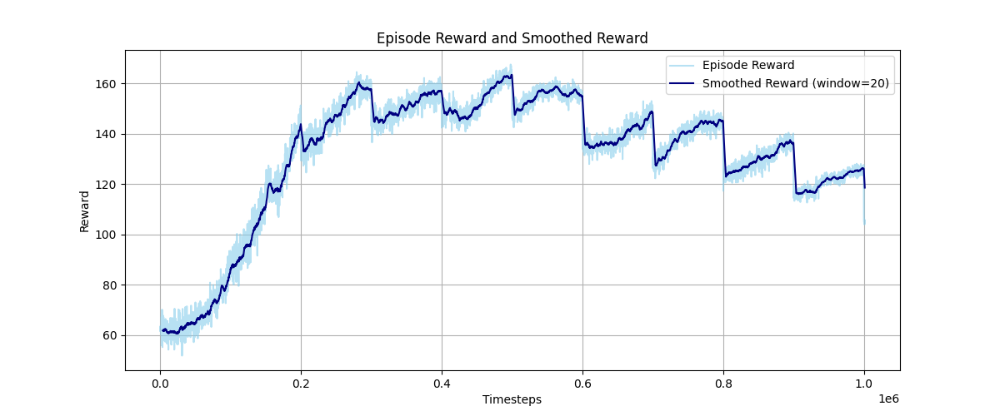
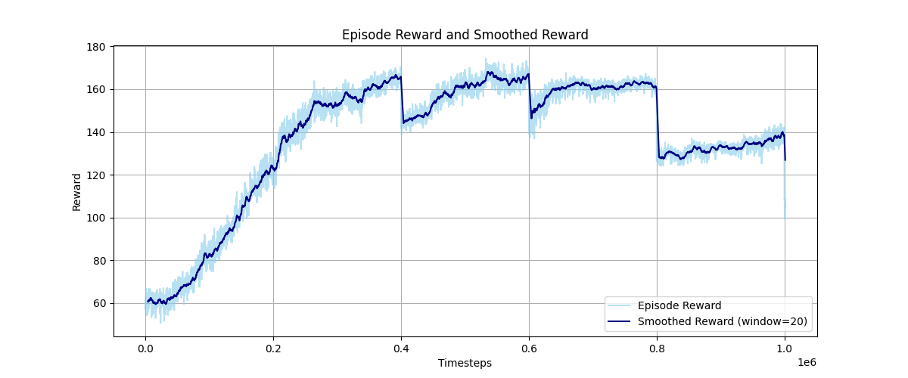
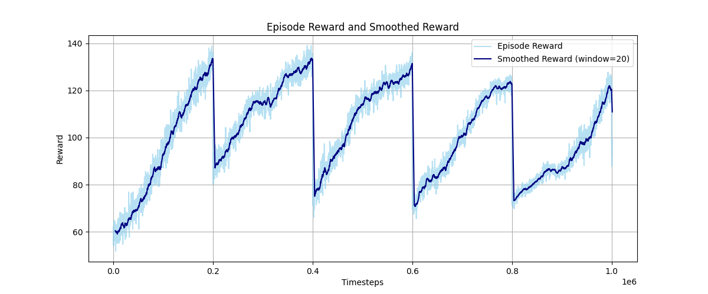
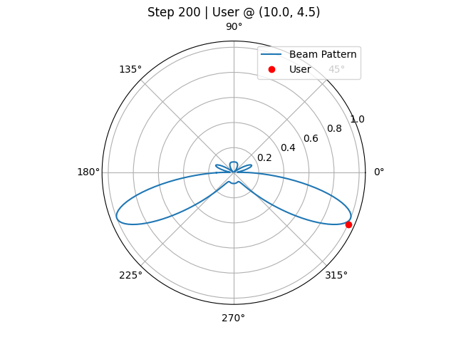
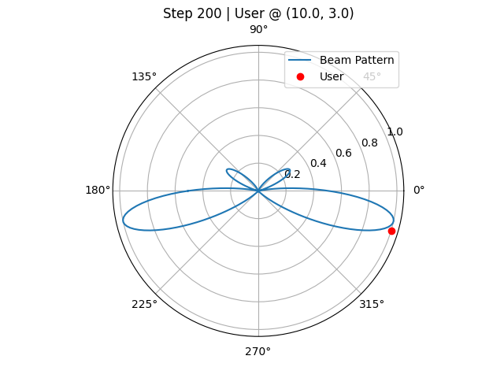
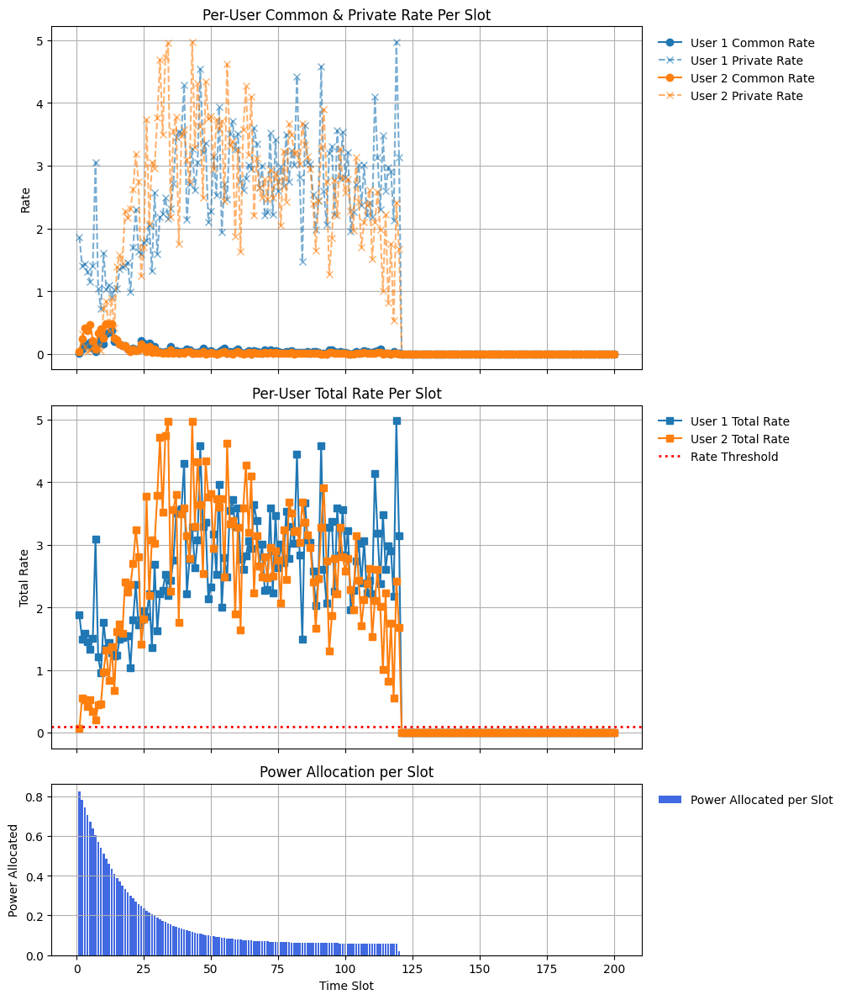

### 1. 关于现有文章对动态环境中设定的个人理解
在现有文献中，动态信道通常假设为在每个时隙中微小变化，其变化主要来源于多普勒频移。根据《Fundamentals of Wireless Communication》第2.4.3节的描述，此类信道模型应被视为 **平稳（stationary）** 过程。在这种建模下，通常在每个 block 内重新获取信道信息。
基于这一假设，我进行了一项仿真实验，目标是研究单用户波束跟踪问题。具体设定如下：
- 基站位置：固定在 (0, 0)
- 用户初始位置：设定在 (10, 0)
- 信道模型：假设为完美的 Line-of-Sight（LoS）信道
- 用户移动方式：每 500 个 episode，用户的 y 坐标增加 1
- 训练总轮数：5000 个 episode
- 每个 episode 包含步骤数：200 steps

根据计算，用户每向 y 方向移动 1 个单位，其视角变化约为 0.17–0.18 度，与基站的距离变化为 0.05 到 0.689 米之间。
在该设置下，分别绘制了：算法的总收益随训练进程变化的收敛曲线；用户处于不同位置时对应的波束指向图。
**实验观察结果如下**：
1. 收敛曲线始终无法稳定收敛：
每当用户位置发生变化（即每 500 个 episode y 坐标变化一次）时，总收益出现明显陡降，随后缓慢回升。这一模式在每次用户位置变动后都会重复出现。
随后，我尝试修改用户位置的变化策略：
每 1000 个 episode，y 坐标增加 2；
每 1000 个 episode，y 坐标增加 1；
每 500 个 episode，y 坐标增加 0.5。
都出现这样的结果。

|用户的位置始终固定不动| 
|:--:|
| |

|每500个episode y增大0.5| 每500个episode y增大1|
|:--:|:--:|
|  |  |

|每1000个episode y增大1| 每1000个episode y增大2|
|:--:|:--:|
|  |  |

2. 波束指向了用户移动轨迹中某一个位置：
在这里我测试了每 500 个 episode以及将信道加入到state中，y 坐标增加 0.5设置下的模型，发现最终训练出来的结果是波束指向用户移动轨迹中某一个位置

|state 中不包含信道| state 中包含信道|
|:--:|:--:|
|  |  |

**图注：state中不包含信道是指state为上一时刻采取的动作；state中包含信道是指state为上一时刻采取的动作以及用户的信道（尽管我不认为将信道加进去是正确的，因为从强化学习的原理上看这样根本行不通，但为了验证这样能不能带来一点更好的表现）。由于state 中不包含信道的这组state没有信道，那么测试的时候随便设置了一个用户的位置，跑出来的结果就是总是保持这个波束图。而state 中包含信道的这组state加入了信道，抱着试一试的态度改变用户位置测试模型，结果一直保持这个样子（改变用户的位置指的是以某一个位置跑完整个step）。**

结果表明，这种无论用户多快多慢的移动或者是否在state中加入信道都无法训练出波束跟随用户的效果。根本原因就是Reinforcement Learning书中提到的强化学习的缺点之一：目前的深度学习（此处我理解为深度强化学习）并不完全适合在线学习。

我对这种将强化学习和通信结合的理解是每次用户位置不变的间隔中其实是在利用强化学习求解一个固定位置但信道受信道估计不精确的影响而有扰动的信道模型下的凸优化问题，一旦位置发生了变化那么就需要强化学习重新学习，那么从算法收敛图看出来相当于强化学习被当成一种online工具可以根据用户的移动实时优化出适配当前位置的波束，那么如果是这样使用强化学习这个工具似乎显得不合理，因为强化学习在求解这种优化问题时似乎并没有凸优化更具有优势，尽管从复杂度的角度，当天线数用户数增多时凸优化的算法复杂度比强化学习更大，但是从最优解的角度强化学习不一定比凸优化更优异。

### 2. 强化学习在通信波束优化问题中的适用性思考
最近，徐老师给了我一个启发性的点子。起初，我对用强化学习（RL）解决波束赋形问题持怀疑态度，因此专门去找徐老师请教。我的疑惑主要在于：传统的通信优化问题往往无法构成马尔可夫过程（MDP），这让RL的应用前景显得不明朗。

徐老师建议我尝试把问题建模为一个长期收益最大化的问题。假设基站的总能量有限，在每个时隙分配能量，目标是让长期总速率最大化。这样，上一个时隙消耗的能量会影响后续收益，整个过程自然构成了MDP，智能体可以学习最优能量分配策略。刚听到这个思路时，我确实很兴奋，因为这意味着RL有望在通信波束优化领域发挥作用。

然而，当我动手实现并跑出实验结果后，却发现这种思路也存在问题。关键原因在于信道建模：在一个episode内信道是stationary的，甚至所有episode都stationary。这样，基站只需学习信道的统计特性，将波束指向信道均值方向即可。至于能量分配，由于信道本身不变，分配策略并没有根据信道显著变化。

在我的具体实验（2用户RSMA系统，用户分别位于-30°和30°，大尺度衰落均为1）中，智能体的state是剩余能量，action是每时隙分配的能量与波束，reward是两个用户的和速率。长期回报即所有时隙的平均和速率。能量分配方式是将action输出的0-1系数乘以最大可分配能量，且总能量没有强制分配完。训练结果显示：初期能量分配多，后期越来越少。我的理解是：初期波束未对齐用户，需要更多能量保证鲁棒性；随着波束逐步对齐，能量需求下降，智能体自然节省能量。

这种现象其实可以用强化学习求解优化问题的基本思路来类比。例如，用RL求解 y=x^2的最小值。可以把state设为当前x，action为下一步的x，智能体通过一系列跳跃靠近最优解。如果不限制动作范围，一步就能到最优。但这种“轨迹”式的优化，本质上并没有充分发挥RL的潜力。训练好的智能体其实就是给定任意初始x，RL帮你生成一条轨迹以最快速度到达最优解。这其实就是把单步最优问题“强行”拆成多步决策。

回到能量分配那个问题，似乎问题的本质不是希望你提供一个智能体，然后我给一个随意的初始值，智能体要给我一系列波束。中间这些波束并不是我想要的，我只需要最终那个波束。所以说这个问题还是不能用马尔可夫的强化学习来解。当然，我的这些观点都建立在信道是几乎不变，只是有一些观测扰动的前提下的。这是因为我认为一旦信道连续变化，就使得环境变成一个non stationary环境了，用一般强化学习去解的话几乎很难紧密跟随。如果需要紧密跟随，那就需要把环境建模成短时间尺度上stationary，长时间尺度上non stationary，因为只有这样才能给智能体足够的时间理解记忆，否则就变成了智能体的目标一直在乱动的情况，这就和DQN中引入Target Network的理由一样。

最后，再举这个一个例子，多臂老虎机的问题，这是一个典型的单步决策问题。假设有的臂收获的奖励更好，有的臂收获的奖励差一些，而且每个臂的分布稳定不变，但赌徒不知道，他需要试探然后获取这个信息。这个问题也可以构建成一个长期收益的问题，state是上一次选择的老虎机，action是当前选择的老虎机以及在这个臂选几次，奖励是老虎机的奖励，一共摇100次，长期收益是这100次的奖励总和。优化过程也是迭代的方式，跳跃选择，最终训练好的智能体就可以实现你输入一个你初始选择的一个臂，然后agent就跳跃着几步之内帮你找到了最好的那个臂并停留在这个臂上。假设现在告诉你你有100块钱，摇一次要花1块钱，希望你能在这一百次内收益最大。乍一看你会觉得这个问题好像不再是一个单纯的找到最优臂的问题了，而是一个如何分配100块钱的问题，在1号臂上多花钱了可能会导致你后面总奖励变少或者变多，然后你就把强化学习问题建模成一个看似符合马尔可夫过程的强化学习问题，state是剩余的钱，action是你在某个时刻选的臂，奖励就是摇当前臂得到的奖励，目标是花光100块钱获得的最大收益。但你仔细想一下，好像这两个是否考虑100块钱开局的问题最终的结果都一样，就是尽快找到最好的臂。加上给某个臂分配多少钱这个动作，反而使动作空间更复杂。所以其实是否考虑100块钱开局都会得到同样的结果，而为什么会出现这个现象，其实就是因为这个问题本身就是一个单步决策问题，但是被强行考虑为多步强化学习问题。

**总结**
能量分配的思路似乎不可行；许多通信优化问题本质上是单步决策问题，强行用MDP框架和RL多步决策的思路去解，往往只是形式上的“迭代轨迹”，并未带来本质优势。还是应以传统优化方法为主，强化学习只能作为补充。

.

### 3. 关于强化学习在无线通信中的应用的另一个思考
[Reconfigurable Intelligent Surface Assisted Multiuser MISO Systems Exploiting Deep Reinforcement Learning](https://arxiv.org/pdf/2002.10072)这篇文章是我第一次接触强化学习在无线通信中应用的一篇论文。
 **首先看看这篇文章**
- 引言中提到这么一句话‘deep learning (DL) has been used to obtain the beamforming matrix for MIMO systems by building a mapping relations between channel information and the precoding design’ ，我理解这句话的意思是深度学习是需要先针对某个信道通过别的方法算出这种信道对应的最优波束，构成(channel, optimal precoder) pair，其中precoder是标签。

- 然后，文章中引言部分接下来提到‘DRL is particularly beneficial to wireless communication systems where radio channels vary over time. DRL is able to allow wireless communication systems to learn and build knowledge about the radio channels without knowing the channel model and mobility pattern, leading to efficient algorithm designs by observing the rewards from the environment and find out solutions of sophisticated optimization problems. In [38], the hybrid beamforming matrices at the BS were obtained by applying DRL where the sum rate and the elements of the beamforming matrices are denoted as states and actions.’ 这段文字的意思是强化学习可以在不需要信道信息的前提下通过自己试探优化出波束来，也就是说可以不需要实时提供信道信息了。

**然后看看作者提供的代码**
- 本文相关的代码库地址是 [RIS-MISO-Deep-Reinforcement-Learning](https://github.com/baturaysaglam/RIS-MISO-Deep-Reinforcement-Learning)。从代码实现可以看出，每个 episode 内的信道是固定的，而不同 episode 之间信道发生变化。每个 episode 的 step 数通常设定为 10000 或 20000。这里之所以 step 设置这么大，就是因为智能体面对每个局部稳态环境需要学习一段时间。

- 由此可见，作者实际上是在用深度强化学习（DRL）去求解一个参数优化问题，并希望智能体能够“记住”每个信道状态对应的最优预编码（precoder），从而在实际应用中，只需输入当前信道状态，智能体就能输出最优预编码，这实际上是把训练好的智能体当作一种“查表法”或“答案册”来使用。

**综合文章和代码，我认为这种思路在实际中很难实现，原因有如下几点：**

1. **智能体记忆能力有限**
强化学习智能体（特别是深度神经网络）本质上更擅长在分布内泛化，而不擅长记忆和准确还原训练过程中遇到的所有信道-最优预编码映射。正如《Reinforcement Learning: An Introduction》（中文版第464页）中所指出的：“每当学到一些新知识时，它都倾向于忘记之前学到的东西，而不是将新知识作为补充。” 这说明智能体在面对大量多变的信道状态时，很容易出现“遗忘”现象，难以做到每个信道都给出精确的最优解。

2. **实验验证**
我的实验也进一步印证了上述观点：在实际测试过程中，训练好的智能体很难在未见过或分布外的信道状态下给出理想的预编码，甚至在部分分布内信道上也无法还原最优决策。这说明通过“查表”式的训练方法，并不能充分利用DRL的优势，也无法实现预期的效果。

3. **对状态空间设置的质疑**
事实上，这种把“信道”直接作为强化学习状态输入的方式，在无线通信领域基于DRL的论文中极为普遍（几乎90%的相关论文都如此设定）。但这样做往往只是在用RL框架“包装”一个静态优化问题，本质上并没有利用到RL的长期决策和动态建模能力。更合理的方法应该是将RL用于环境具有真正马尔可夫性、状态随动作动态演化的问题上。

4. **总结**
目前常见的“DRL in wireless”论文中，常见的“信道作为状态”设计和“episode内信道不变”设定，实际上只是把复杂的静态优化问题搬到RL框架下，并没有发挥RL的本质优势。面对大规模、高维度的优化任务，DRL智能体并不适合作为“万能查表器”来记忆所有信道-最优预编码关系，这既违背了RL的工作原理，也很难获得理想的泛化效果。

### 4. 强化学习在通信中可行应用场景的思考
强化学习（RL）近年来在无线通信领域的应用越来越广泛，但我始终认为，强化学习对在线决策问题（online decision making）是敏感且存在短板的。因为在真正的在线系统中，时延要求高，环境变化快，RL 的表现往往不尽如人意。

从本质上讲，在线问题通常意味着系统处于一个动态非平稳环境中，且要求在极短时间内给出响应策略。例如，在高速用户移动、干扰快速变化、或信道条件频繁切换的情况下，强化学习模型往往来不及适配环境的变化，也难以在每次变化后迅速完成策略更新。这种场景下的决策，更适合具备低复杂度、快速推理能力的算法，而不是训练和推理过程都相对“重”的强化学习框架。

相比之下，我认为强化学习在通信系统中更合适的落地点在于一些稳态环境下的资源部署与长期策略设计问题。我个人理解的可行的应用场景包括：

- 基站部署优化：目标是在既定区域内选择最佳基站位置以最大化覆盖率或系统容量；

- 可重构智能表面（RIS）的部署与配置：如RIS面板在建筑物外墙的位置选择、面板尺寸设计、反射单元的模式选择；

- 大尺度资源配置问题：如频谱分配策略、长期缓存策略、卫星轨道优化等。

这类问题具备以下特点：

1. 非实时要求：部署或配置通常在分钟、小时甚至天级别的时间尺度内进行，不需要毫秒级的响应；

2. 环境变化慢：即使有用户进出或网络流量变化，也可以在一定时间内等效为“广义平稳过程”；

3. 状态和动作空间较大，传统方法效率受限：强化学习在高维空间中的策略探索能力可以成为优势。

当然，必须承认的是，这些稳态优化问题也可以用其他经典算法求解，如启发式搜索、遗传算法、粒子群优化、凸优化等。因此，强化学习是否具有明显优势，依赖于问题是否具备高维复杂性、非凸性、或需要分布式学习能力。只有在这些场景下，RL 才可能体现出真正的价值。

总结来看，强化学习不是通信系统问题的“银弹”（silver bullet）。它更适合在延迟容忍度高、系统动态性低、传统优化方法遇到瓶颈的场景中发挥作用。而在强调在线性能、低延迟响应的任务中，强化学习仍然面临诸多挑战，亟需算法级的突破，例如元学习（Meta-RL）、快速自适应策略搜索、在线微调等，未来或许才能真正实现“秒级响应的学习智能”。

接上，**似乎这样也不行**。起先将强化学习应用到无线通信是希望利用强化学习model free的优势（这算是我能说服自己强化学习相较于其他方法的优势之一了），这样可以不需要时刻进行信道估计，而是让基站自己去适应环境了解环境的统计分布情况。尽管已经基本上坐实了基于马尔可夫的强化学习不适合用于波束设计中，但是单步决策的强化学习还尚有一丝生机。

然而，进一步思考后会发现，即使是单步决策的强化学习（如多臂老虎机问题）在通信场景下也面临诸多挑战。在多臂老虎机问题中，赌徒的核心任务，是在不了解每个老虎机臂奖励概率的前提下，通过不断试探，最终摸索出哪个臂的奖励概率更高。实质上，这是在挖掘环境的“内部设置”。但如果环境本身是非静态的——比如某一天老虎机老板临时调整了奖励概率设定——那么赌徒之前所有的探索努力几乎白费，不得不重新花费大量精力和成本去适应新的环境，这对资源和时间都极为不利。

更重要的是，强化学习的“探索”过程往往意味着系统需要尝试未知的策略，这可能导致性能波动，甚至带来较大的风险。在无线通信实际部署中，系统的稳定性是首要考量，用户对通信质量的高要求也不允许系统出现大幅度的性能下降。因此，将强化学习以在线方式直接部署于通信系统，尤其是在对可靠性和稳定性要求极高的场景中，几乎是不可行的。

综上，单步决策的强化学习方法更适用于那些对时延不敏感、环境信息难以获取或不便获取、且训练周期可以非常长，并且甲方愿意为模型的长期训练过程买单的应用场景。而对于大多数实际无线通信系统，尤其是对稳定性和实时性有高要求的场合，单步决策型强化学习的适用性非常有限。

接上，那么现在强化学习在无线通信的应用场景仅仅是作为一种优化算法了，可是强化学习本身训练比较慢，计算机资源要求高，不一定比别的算法快。那么接下来的任务就是对比现有其他算法和强化学习在解离散问题谁更有优势，因为我认知中只有这块儿是凸优化确实很难做到的。算了，我感觉强化学习也不适合，因为既然能构建成优化问题了，那么就是model based了，强化学习的天然优势全被摁下去了。强化学习在通信中的应用我目前彻底放弃了，不碰了。希望后续有人能够找到切入点吧。

补充：[GAMBIT: A Generalized Adaptive Multi-Armed Bandit for Intelligent Beam Tracking and Rate Adaptation](https://ieeexplore.ieee.org/document/11039126) 这篇文章在引言部分明确说了‘Furthermore, for the beam tracking problem, selecting a new action (beam) does not change the system’s state space. In other words, choosing a beam at time t does not affect the set of beams that can be chosen at time t+1, so the problem can be adequately modeled as a single-state Markov decision process (MDP). In such cases, introducing Q-learning or DQN adds complexity without providing substantial benefits.’ 意思是波束追踪问题不适合使用DQN来解，理由是问题本身不能被建模为MDP，而是单一状态的MDP，使用DQN增加了复杂度但并没有得到有效的性能提升。