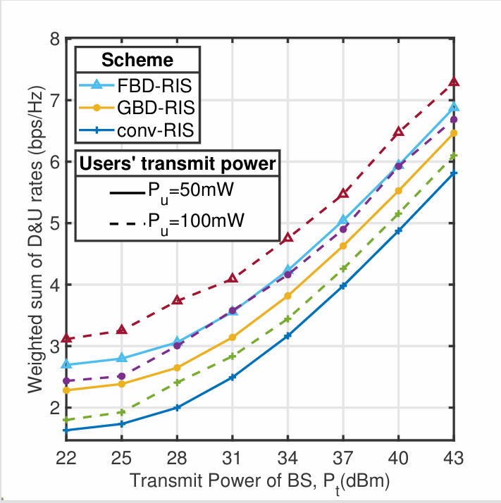

#### 1 如何绘制出如下的双图例的结果图
先来看一个例子，下面罗列了某次实验计划在一张图上展示的所有实验组：

$$
\begin{aligned}
(1) FBD-RIS, P_u=50mW,\\
(2)GBD-RIS, P_u=50mW,\\
(3)conv-RIS, P_u=50mW,\\
(4)FBD-RIS, P_u=100mW,\\
(5)GBD-RIS, P_u=100mW,\\
(6)conv-RIS, P_u=100mW,\\
\end{aligned}
$$
可以看出来这里有6组实验，如果在图例中直接显示出来会很长，而且信息很冗杂。从这6个分组可以看出其实可以将它们分成两个大类，一类包含FBD-RIS，GBD-RIS和conv-RIS，另一类包含Pu=50mW和Pu=100mW，尽管这个例子中分类处理之后的实验组还是有5组，只是减少了1组，但是从视觉感受来说这种分类的方式更有吸引力，减少了冗余信息的展示。结果图如下：



如何实现呢？
```
[data1,data2] = getdata(); %提供数据的接口

x = 22:3:43;

figure;
% 第一组：Pu = 50mW
h1 = plot(x, data1(:,1), '-^', 'LineWidth',2, 'Color','#4DBEEE','MarkerSize',6); hold on
h2 = plot(x, data1(:,3), '-*', 'LineWidth',2, 'Color','#EDB120','MarkerSize',6);
h3 = plot(x, data1(:,2), '-+', 'LineWidth',2, 'Color','#0072BD','MarkerSize',6);

% 第二组：Pu = 100mW
h4 = plot(x, data2(:,1), '--^', 'LineWidth',2, 'Color','#A2142F','MarkerSize',6);
h5 = plot(x, data2(:,3), '--*', 'LineWidth',2, 'Color','#7E2F8E','MarkerSize',6);
h6 = plot(x, data2(:,2), '--+', 'LineWidth',2, 'Color','#77AC30','MarkerSize',6);

% 设置坐标轴格式
xticks(x)
axis([22 43 min([data1(:); data2(:)])*0.9 max([data1(:); data2(:)])*1.1])
grid on
box on
xlabel('Transmit Power of BS, P_t(dBm)', 'FontName','Times New Roman')
ylabel('Weighted sum of D&U rates (bps/Hz)', 'FontName','Times New Roman')

% 第一个图例（算法类型）
legend1 = legend([h1 h2 h3], {'FBD-RIS', 'GBD-RIS', 'conv-RIS'});
legend1.Location = 'northwest';
title(legend1, 'Scheme');

% 创建透明坐标轴用于第二个图例（用户发射功率）
ax1 = gca;
ax2 = axes('Position', ax1.Position, ...
           'Color', 'none', ...
           'XColor', 'none', 'YColor', 'none', ...
           'XTick', [], 'YTick', [], ...
           'HitTest', 'off');

hold(ax2, 'on');
h50 = plot(ax2, nan, nan, '-', 'Color','k', 'LineWidth',2);
h100 = plot(ax2, nan, nan, '--', 'Color','k', 'LineWidth',2);
hold(ax2, 'off');

legend2 = legend(ax2, [h50 h100], {'P_u=50mW','P_u=100mW'});
legend2.Location = 'northeast';
legend2.Color = 'w';
title(legend2, 'Users'' transmit power');  % 注意两个单引号表示转义 '
```


从结果图可以看出这个代码对图例实现了分类，一类是Scheme另一类是Users' transmit power，而且在图中对这两个类别分别进行了显示，并附加了类别名。


